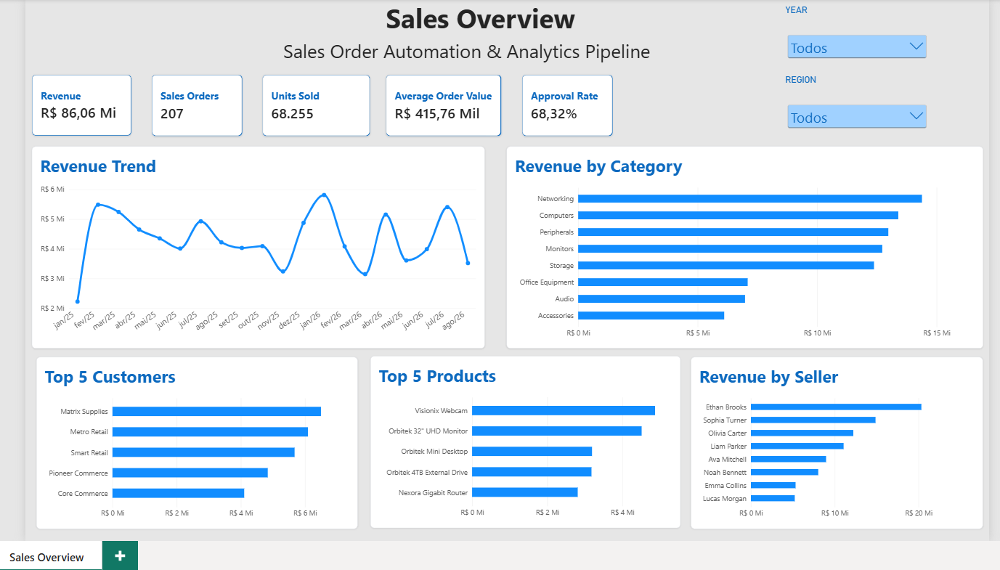

# Sales Order Automation & Analytics Pipeline

End-to-end data and process automation project that simulates the processing of purchase orders for a B2B technology distributor.

The solution extracts purchase orders from PDF, enriches the data using an Excel product master and a simulated ERP REST API, applies business validation rules, stores the processed data in PostgreSQL, builds an analytical star schema, and delivers business insights through Power BI.



---

## Project Overview

In a typical B2B sales operation, purchase orders may arrive through documents that require manual processing before they can be registered in an ERP.

This project simulates that scenario with hundreds of purchase orders contained in a consolidated PDF file.

Instead of manually reading each order, checking customers and products, validating inventory, calculating order values, and preparing reports, the pipeline automates the entire process.

The project covers both **operational automation** and **analytical data processing**, from raw documents to a Power BI dashboard.

---

## Business Problem

The simulated company receives purchase orders containing customer and product information that must be validated before processing.

A manual workflow would require:

- Reading purchase orders from PDF
- Identifying customers and products
- Checking product master data
- Consulting ERP information
- Checking customer and product status
- Validating inventory availability
- Validating package quantities
- Detecting duplicate orders
- Calculating order values
- Separating approved and rejected orders
- Preparing operational reports
- Consolidating data for business analysis

With hundreds of orders, this process becomes repetitive, time-consuming, and susceptible to human error.

---

## Solution

The project implements an automated pipeline that:

1. Extracts purchase orders from a consolidated PDF
2. Converts document content into structured Python objects
3. Loads product master data from Excel
4. Retrieves customer, product, seller, price, and inventory information from a simulated ERP REST API
5. Applies business validation rules
6. Classifies orders as approved or rejected
7. Generates an operational Excel report
8. Stores processed data in PostgreSQL
9. Transforms operational data into a dimensional analytics model
10. Visualizes business KPIs in Power BI

---

## Project Architecture

```text
Purchase Orders PDF
        |
        v
  Python Extraction
        |
        v
 Standardized Orders
        |
   +----+----+
   |         |
   v         v
 Excel     ERP API
 Product   Customer
 Master    Product
           Inventory
           Seller
   |         |
   +----+----+
        |
        v
 Business Validation
        |
   +----+----+
   |         |
   v         v
Approved   Rejected
 Orders     Orders
   |         |
   +----+----+
        |
        v
 Operational Excel Report
        |
        v
    PostgreSQL
        |
        v
 Dimensional Model
        |
        v
     Power BI
```

---

## Processing Results

The synthetic dataset currently contains:

| Metric | Result |
|---|---:|
| Order records processed | 303 |
| Unique purchase orders | 300 |
| Order items processed | 1,804 |
| Approved orders | 207 |
| Rejected orders | 96 |
| Approval rate | 68.32% |
| Approved revenue | R$ 86.06M |
| Units sold | 68,255 |
| Customers | 35 |
| Products | 150 |
| Sales representatives | 8 |

Intentional data quality and business-rule violations were introduced into the synthetic dataset to test the validation pipeline.

---

## Business Validation Rules

Orders and items are automatically validated against multiple business rules.

The pipeline detects:

- Duplicate purchase orders
- Unknown customers
- Inactive customers
- Unknown products
- Inactive products
- Invalid quantities
- Quantities incompatible with package configuration
- Insufficient inventory

Validation errors are stored with structured error codes such as:

```text
CUSTOMER_NOT_FOUND
INACTIVE_CUSTOMER
PRODUCT_NOT_FOUND
INACTIVE_PRODUCT
INVALID_QUANTITY
INVALID_PACKAGE_QUANTITY
INSUFFICIENT_STOCK
DUPLICATE_ORDER
```

This allows rejected orders to remain traceable instead of being silently discarded.

---

## Simulated ERP REST API

A REST API was created with FastAPI to simulate integration with an ERP system.

The pipeline can retrieve:

- Customer information
- Customer status
- Seller information
- Product information
- Product status
- Unit prices
- Inventory availability

Example endpoints:

```text
GET /api/customers/{customer_code}
GET /api/products/{product_code}
GET /api/inventory/{product_code}
GET /api/sellers/{seller_id}
```

This separates operational ERP data from the document-processing pipeline and simulates a real system integration.

---

## Operational Excel Report

After processing, the pipeline automatically generates:

```text
data/output/processed_orders.xlsx
```

The workbook contains four sheets:

| Sheet | Description |
|---|---|
| Processing Summary | Overall processing metrics and rejection summary |
| Approved Orders | Approved order items with enriched business data |
| Rejected Orders | Rejected orders and their validation reasons |
| Rejected Items | Item-level validation errors |

The workbook is formatted automatically using Python and OpenPyXL.

---

## PostgreSQL Data Layer

Processed orders are persisted in PostgreSQL.

The operational database stores information about:

- Customers
- Sellers
- Products
- Orders
- Order items
- Processing errors

The loading process is transactional, allowing the pipeline to maintain consistent data during execution.

PostgreSQL runs inside Docker, making the database environment reproducible.

---

## Analytics Data Model

The operational data is transformed into a dimensional model designed for analytics.

### Dimensions

```text
dim_customer
dim_product
dim_seller
dim_date
dim_error
```

### Facts

```text
fact_sales
fact_order_processing
fact_order_error
```

The model follows a star-schema approach and separates commercial metrics from order-processing and data-quality metrics.

---

## Power BI Dashboard

The final analytical layer is implemented in Power BI.

The dashboard provides an executive overview of sales performance.

### Main KPIs

- Revenue
- Sales Orders
- Units Sold
- Average Order Value
- Approval Rate

### Analyses

- Revenue trend
- Revenue by product category
- Top customers
- Top products
- Revenue by seller
- Filtering by year
- Filtering by region


The Power BI file is available at:

```text
powerbi/sales_analytics_dashboard.pbix
```

---

## Technology Stack

| Area | Technology |
|---|---|
| Programming | Python |
| Data Processing | Pandas |
| PDF Extraction | pdfplumber |
| Excel Integration | OpenPyXL |
| REST API | FastAPI |
| HTTP Integration | Requests |
| Database | PostgreSQL |
| Data Modeling | SQL |
| Database Environment | Docker |
| Analytics | Power BI |
| Version Control | Git / GitHub |

---

## Project Structure

```text
sales-analytics-pipeline/
|
+-- data/
|   +-- raw/
|   |   +-- excel/
|   |   +-- pdf/
|   |   +-- seed/
|   +-- output/
|
+-- database/
|   +-- analytics/
|   +-- init.sql
|
+-- docs/
|   +-- images/
|   |   +-- sales_overview.png
|   +-- project_scope.md
|
+-- powerbi/
|   +-- sales_analytics_dashboard.pbix
|
+-- scripts/
|   +-- generate_sample_data.py
|
+-- src/
|   +-- api/
|   +-- data/
|   +-- database/
|   +-- extraction/
|   +-- integration/
|   +-- output/
|   +-- validation/
|   +-- main.py
|
+-- compose.yaml
+-- requirements.txt
+-- .env.example
+-- README.md
```

---

## Running the Project

### 1. Clone the repository

```bash
git clone https://github.com/GeandroRdS/sales-analytics-pipeline.git
cd sales-analytics-pipeline
```

### 2. Create a virtual environment

Windows:

```bash
python -m venv .venv
.venv\Scripts\activate
```

### 3. Install dependencies

```bash
pip install -r requirements.txt
```

### 4. Configure environment variables

Create a `.env` file based on:

```text
.env.example
```

Example:

```env
POSTGRES_DB=sales_analytics
POSTGRES_USER=sales_user
POSTGRES_PASSWORD=your_password
POSTGRES_HOST=localhost
POSTGRES_PORT=5433
```

### 5. Start PostgreSQL

```bash
docker compose up -d
```

### 6. Generate the synthetic dataset

```bash
python scripts/generate_sample_data.py
```

### 7. Start the simulated ERP API

Open another terminal:

```bash
uvicorn src.api.erp_api:app --reload
```

### 8. Run the processing pipeline

```bash
python src/main.py
```

The pipeline will extract, enrich, validate, report, and persist the purchase-order data.

---

## Synthetic Data

All customers, products, sellers, purchase orders, prices, inventory values, brands, and financial results used in this repository are **synthetic**.

The dataset was generated specifically for this portfolio project and does not represent any real company or customer.

A fixed random seed is used during data generation to keep the environment reproducible.

---

## What This Project Demonstrates

This project demonstrates practical experience with:

- Business process automation
- PDF data extraction
- Data cleaning and transformation
- Excel automation
- REST API integration
- Business-rule validation
- Error handling and traceability
- PostgreSQL persistence
- SQL data modeling
- Dimensional modeling
- ETL/ELT concepts
- Power BI dashboard development
- Dockerized database environments
- Git-based version control

It was designed as an end-to-end example of how operational automation and analytics can be combined in a single data solution.

---

## Author

**Geandro Ribeiro da Silva**

Data Analysis • Python Automation • SQL • Power BI